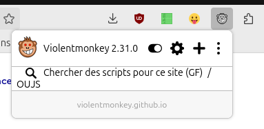
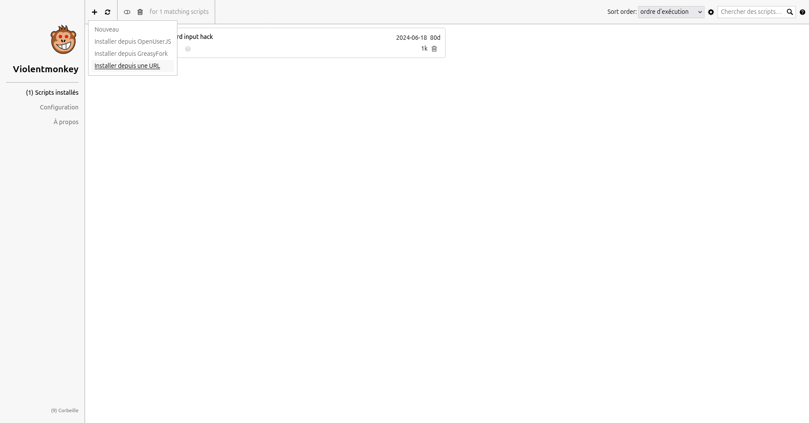

Un script pour l'extension navigateur ViolentMonkey, qui ajoute un calendrier plus ergonomique à Minot@ur.

ATTENTION, N'INSTALLEZ JAMAIS UN SCRIPT DONT VOUS N'ÊTES PAS SÛR DE LA SOURCE !

# Guide d'installation

## Installation de l'extension ViolentMonkey

- Pour **Firefox** : https://addons.mozilla.org/fr/firefox/addon/violentmonkey/
- Pour **Chrome (et navigateurs dérivés)** : https://chromewebstore.google.com/detail/violentmonkey/jinjaccalgkegednnccohejagnlnfdag

*Note 1 : Sur mobile android, seul Firefox est capable d'installer des extensions navigateur*

*Note 2 : Il n'est pas possible d'installer l'extension sur Safari et les appareils iOS (sur Mac, il est cependant possible d'utiliser Firefox ou Chrome)*

## Installation du script

l'icône de l'extension est un singe aux yeux rouges, cliquez sur celle-ci pour ouvrir le menu de l'extension.
Accédez aux paramètres de l'extension en cliquant sur la roue crantée (il est nécessaire de passer par les paramètres pour utiliser un script depuis une URL) :

Cliquez sur le signe + puis sur "Installer depuis une URL"

Entrez l'adresse suivante dans la boîte de dialogue, puis validez :

**https://github.com/Jupi007/Minotaur-enhance-patch/raw/refs/heads/dist/dist/minotaur-enhance-patch.user.js**

Afin appuyez sur le bouton "Installer"

Accédez à Minot@ur, un calendrier devrait s'afficher sur les pages "Mes missions et disponibilités" et "Appels à volontaires"
